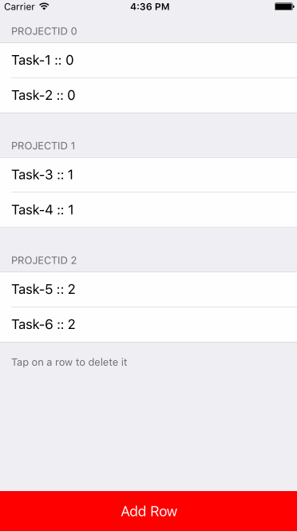

[](https://travis-ci.org/redbooth/RealmResultsController)


A NSFetchedResultsController implementation for Realm written in Swift

###Quick Start:

#### Create a RealmRequest:

The `RealmRequest<T>` needs 3 parameters:

- A Predicate
- A Realm DB
- Sort Descriptors

Where `T` is a `Realm` model


``` swift
let realm = // Your realm DB
let predicate = NSPredicate(format: "id != 0")
let sortDescriptors = [SortDescriptor(property: "projectID"), SortDescriptor(property: "name")]
let request = RealmRequest<TaskModel>(predicate: predicate, realm: realm, sortDescriptors: sortDescriptors)
```

#### Create the RealmResultsController
The `RealmResultsController<T, U>` needs 4 parameters:

- A `RealmRequest<T>`
- The section key path (optional)
- A mapper like `func mapper(obj: T) -> U` (optional)
- A filter like `func filter(obj: T) -> Bool` (optional)

Where `T` is a `Realm` model and `U` is the type of the object you want to receive from the RRC. Since the RRC works in background, we can't work with normal Realm objects, so we either create mirror copies of the objects not associated to any Realm, or we map the Objects to another kind of "entity" of type `U`

Operations on each RRC are enqueued to avoid unordered calls to `willChangeResults` and `didChangeResults`. Each RRC has its own queue.

__Note:__ `T` and `U` can be of the same type, then the RRC will return a copy of the `T` objects but not included in any Realm.

__:heavy_exclamation_mark: what is the `filter` for?__
You may ask, if the `RealmRequest` already has a `NSPredicate` to filter the results, why does the RRC accept a filter func? Well, very simple:
- The NSPredicate only lets you filter by Realm properties, and is very limited.
- With this extra filter block, you can have more granulated results, filtering using the value of relationships, or filtering depending on the result of an internal method of the Model.
- It is a workaround to the limited functionality of NSPredicate in Realm :)
- It is not mandatory, by default the filter closure is nil.

:warning: - If the sectionKeyPath is not nil, it MUST match the first `SortDescriptor` of the `RealmRequest`. Otherwise it will raise an Exception.

:warning: 2 - Realm does not accept a `SortDescriptor`s that access a property of a relatonship. That limits the sectionKeyPath to be only a property of the current object


``` swift
// In this example we ask for TaskModel objects in Realm,
// and we want it to map the results to a Task entity,
// this entity defines it's own mapper in `Task.map`
let rrc = RealmResultsController<TaskModel, Task>(request: request, sectionKeyPath: sectionKeypath, mapper: Task.map, filter: MyFilterFunc)
rrc.delegate = self

// With NIL filter, same as before, but we can ignore the 
// filter property if we don't want to use it
let rrc = RealmResultsController<TaskModel, Task>(request: request, sectionKeyPath: sectionKeypath, mapper: Task.map)
rrc.delegate = self

// OR without mapper nor filter, this is a special init. 
// Since we don't want to change the result type, we say to the RRC that `T` is the same as `U`. 
// The filter will be nil.
let rrc = RealmResultsController<TaskModel, TaskModel>(request: request, sectionKeyPath: sectionKeypath)
rrc.delegate = self

```

#### Implement the RealmResultsControllerDelegate methods

`RealmResultsControllerDelegate` has 4 methods that are required:

``` swift
func willChangeResults(controller: AnyObject)
func didChangeObject<U>(object: U, controller: AnyObject, oldIndexPath: NSIndexPath, newIndexPath: NSIndexPath, changeType: RealmResultsChangeType)
func didChangeSection<U>(section: RealmSection<U>, controller: AnyObject, index: Int, changeType: RealmResultsChangeType)
func didChangeResults(controller: AnyObject)
```

You can access the elements in the RRC using this public methods:

```swift
// Returns all the Sections including its objects
public var sections: [RealmSection<U>] 

// count of Sections
public var numberOfSections: Int 

// Number of Objects in a Section
public func numberOfObjectsAt(sectionIndex: Int) -> Int 

//Object at a given indexPath (ideal for cellForRow... in table views )
public func objectAt(indexPath: NSIndexPath) -> U 

// Change the filter currently used. IMPORTANT! after calling 
// this method you should reload your table `tableView.realoadData()`
public func updateFilter(newFilter: T -> Bool) 
    
```


#####RealmResultsChangeType:
It an `enum` with four different types:

- Insert
- Delete
- Update
- Move

``` swift
enum RealmResultsChangeType: String {
    case Insert
    case Delete
    case Update
    case Move
}
```


#### Initial Fetch

In order to start receiving the `RealmResultsController` events, you need to do an initial fetch. After that you'll start receiving changes in the delegate methods

``` swift
rrc.performFetch()
```


### Important info:

####Methods to add/delete objects:

In order for the `RealmResultsController` to receive the change events in a Realm, you must use our custom methods. Those are declared in a Realm Extension and are wrappers for the original Realm methods

#####Add:
``` swift
public func addNotified<N: Object>(object: N, update: Bool = false)
public func addNotified<S: SequenceType where S.Generator.Element: Object>(objects: S, update: Bool = false)
public func createNotified<T: Object>(type: T.Type, value: AnyObject = [:], var update: Bool = false) -> T?
```
#####Delete:

``` swift
public func deleteNotified(object: Object)
public func deleteNotified<S: SequenceType where S.Generator.Element: Object>(objects: S)
```

####Notify single object updates:
RRC has no way to detect single objects updates inside a write transaction. The way to notify of a change an object change that is not an addition nor a creation is by calling `notifyChange()`.

`notifyChange()` is a methods inside a RealmObject extension, and here there's an example of use:

```swift
    let user = User()
    user.name = "old name"
    
    realm.write {
        realm.addNotified(user)
    }
    
    // STUFF GOING ON...
    
    realm.write {
        user.name = "new name"
        user.notifyChange() //Notifies that there's a change on the object
    }
```


####RealmRequest:

You can use a RealmRequest to retrieve the objects it is asking for without linking it to a RealmResultsController. It is going to return `Results<T>`

``` swift
let predicate = NSPredicate(format: "id != 0")
let sortDescriptors = [SortDescriptor(property: "projectID"), SortDescriptor(property: "name")]
let sectionKeypath = "projectID"
let request = RealmRequest<TaskModel>(predicate: predicate, realm: realm, sortDescriptors: sortDescriptors)

//Execute the request
let objects = request.execute()
```

You can also make a realm execute a certain request

```
let objects = realm.execute(request)

```

####Other methods added on the Realm Extension

#####ToArray()

In realm, when you ask for objects in the DB, you receive `Results<T>`
So, we added a the `toArray()` method to convert it to a common `Array<T>`:

``` swift
let objects = realm.objects(TaskModel.self).toArray()
```


###Listen to Realm changes

If you are using the RRC methods to add/delete objects you are able to listen to all Realm changes.

Just add an observer to an object like this:

```swift
let object = Object()
NSNotificationCenter.defaultCenter().addObserver(self, selector: "YOUR_FUNC", name: object.objectIdentifier(), object: nil)
```

`objectIdentifier()` is a method defined in an `Object` extension that is going to build an identifier for the given object. Its structure is `ObjectType-PrimaryKeyValue`

###Disclaimer

For the moment, RRC is not capable of detecting changes introduced in an object saved through a relationship of another object.

Example:

```swift
let user = User()
user.id = 123
user.name = "John"
realm.addNotified(user)

let task = Task()
user.name = "Steven" //This change is not going to be notified
task.assignedUser = user
realm.addNotified(task)

// There will be only one notification for the Task object

```


### Demo:

To use the demo, just run the following command to install the Realm dependencies using Carthage:

`carthage update --platform iOS`

<p align="center">

</p>

###Installation:

#### Carthage:

```
github "redbooth/RealmResultsController" "0.4.0"
```

#### CocoaPods:

```
use_frameworks!

pod 'RealmResultsController', '~> 0.4.0'
```

#### Manual:

#####Copy the RealmResultsController source files

Copy the files inside the `/Source` folder to your project

#####Install Realm for Swift 2.0 
More info [here](https://realm.io/docs/swift/latest/#installation-swift-20)

### Technical details:
- Swift 2.1

###Licenses
All source code is licensed under the `MIT License`.

If you use it, we'll be happy to know about it.
